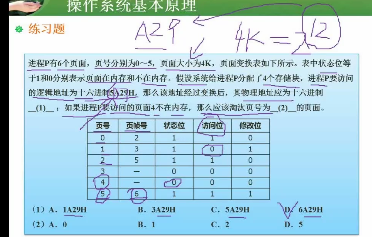
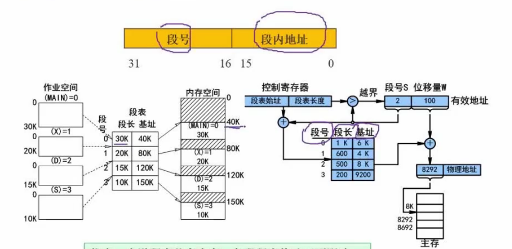

### 一：进程管理

#### 1：进程状态转换
+ 进程的概念
+ 进程的状态
+ 进程的死锁

#### 2：进程管理（进程的同步与互斥）

+ 同步
+ 互斥

#### 3：信号量与PV操作（★）

+ 临界（互斥）资源：诸多进程之间需要互斥方式对其共享使用的资源
+ 临界区：每个进程访问临界资源的那段代码
+ 信号量：P（S），V（S），其中S就是信号量
+ P操作：P操作会阻塞进程，直到一个V操作来唤醒它。P操作会将信号量的值减1。
+ V操作：V操作会释放CPU资源，即当前线程放弃执行机会，取唤醒一个P操作

所以，在PV操作与前驱图结合的题型中，前驱图中没有入度的节点，一定是V操作。

​	银行家算法（★）

#### 4：PV操作与前驱图（★）

这个点是考试中考的最多的，记住一点：`前驱图中没有入度的节点，一定是V操作`。

### 二；存储管理

#### 5：存储管理-存储方式

+ 分区存储

+ 页式存储

  利用率高，碎片小，分配及管理简单

  缺点：增加了系统开销，可能产生抖动现象

  

  例题：

  

  > 解：页面大小为4K，即2^12^，逻辑地址为16进制的5A29H，根据十六进制与二进制转法，5为溢出位，所以5是页号，根据页号5得到页帧号6，6和A29拼接得到真正的物理地址即**6A29H**。第二问看访问位，由于页号1的访问位为0，所以淘汰页号1

+ 段式存储

  多道程序共享内存，各段程序修改互不影响

  缺点：内存利用率低，内存碎片浪费大

  

  段号0，段长30k，基址40k，即从40k的位置开始往下30k为段号0的存储空间

+ 段页式存储
  空间浪费小，存储共享容易，存储保护容易，能动态连接

  缺点：复杂性和开销增加，需要的硬件以及占用的内容也有所增加，使得执行速度大大下降 

#### 6；存储管理-读取方式
+ 随机存取
+ 直接存取
+ 顺序存取

#### 7：存储管理-页面置换算法

+ 最优
+ 随机
+ 先进先出（FIFO）可能抖动
+ 最近最少使用（LRU）

#### 8：通过逻辑地址计算物理地址

### 三：磁盘管理

#### 9：相关计算
+ 磁道数计算
+ 磁盘容量计算

#### 10：磁道调度算法

#### 11：磁盘数据的存取过程

### 四：文件管理

#### 12：文件和树形目录结构
+ 目录结构
+ 绝对路径
+ 相对路径

#### 13：文件管理（空闲存储空间的管理）

+ 空闲区表法
+ 空闲链表法
+ 位示图法（☆）

### 五：设备管理

#### 14：设备管理（数据传输控制方式）

+ 程序控制方式

  需要CPU介入，CPU主动询问设备

+ 程序中断方式

  设备主动告知CPU

+ DMA方式

  专有设备负责数据传输

#### 15：设备管理（虚设备与Spooling技术）

### 六：作业管理

 

