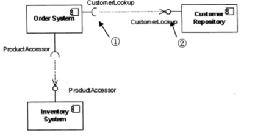
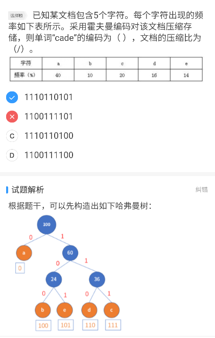
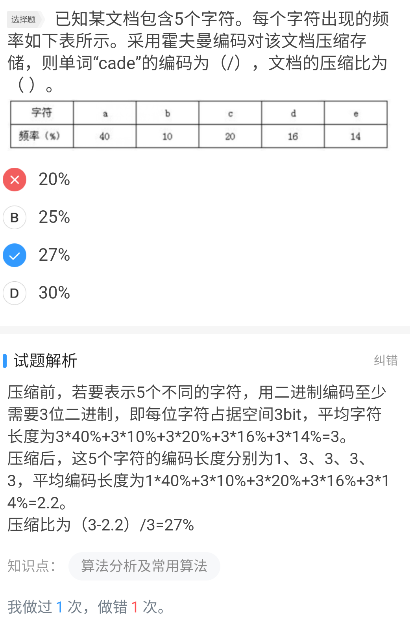

### 2018年题目

1. 采用n位补码(包含一个符号位)表示数据,可以直接表示数值()

   **-2^n-1^**

    在计算机中，n位补码（表示数据位），表示范围是 -2^n-1^ ~ 2^n-1^-1，其中最小值为认为定义，以n=8为例，其中-128的补码是人为定义的10000000。             

****

2. 有可能无限期拥有的知识产权是

   **商标权**

****

3. 结构化分析的输出不包括

   **结构图**

   > 包含数据流图 数据字典 加工逻辑说明 补充材料

****

4. 某文件管理系统在磁盘上建立了位示图(bitmap）,记录磁盘的使用情况。若磁盘上物理块的编号依次为:0、1、2、...;系统中的字长为32位，位示图中字的编号依次为:0、1、2、..，每个字中的一个二进制位对应文件存储器上的一个物理块，取值0和1分别表示物理块是空闲或占用。假设操作系统将2053号物理块分配给某文件，那么该物理块的使用情况在位示图中编号为(）的字中描述。

   **64**

   2053/32=64.156 也就是第65个物理块,从0开始计数所以是编号64

****

5. 某操作系统文件管理采用索引节点法。每个文件的索引节点有8个地址项，每个地址项大小为4字节，其中5个地址项为直接地址索引，2个地址项是一级间接地址索引，1个地址项是二级间接地址索引，磁盘索引块和磁盘数据块大小均为1KB。若要访问文件的逻辑块号分别为1和518，则系统应分别采用( ) 。

   **直接地址索引和二级间接地址索引**

   > 1kb/4=256块,
   >
   > 前五个位0-4号逻辑块号,
   >
   > 后两个一级范围则是5-260 261-516
   >
   > 所以是直接和二级

****

6. 某企业拟开发一个企业信息管理系统,系统功能与多个部门的业务相关。现希望该系统能够尽快投入使用,系统功能可以在使用过程中不断改善。则最适宜采用的软件过程模型为( ) 

**演化模型**

>  	本题要求尽量投入使用，并可以再使用过程中不断完善，对于原型模型和演化（迭代）模型，演化模型更合适，原型模型更适用于需求不明确时用以获取需求。  

****

7.  CMMI模型 一定要记住各等级关键词!!!!!				
   CL0（未完成的）：过程域未执行或未得到CL1中定义的所有目标。

    CL1（已执行的）：其共性目标是过程将可标识的输入工作产品转换成可标识的输出工作产品，以实现支持过程域的特定目标。
    CL2（已管理的）：其共性目标是集中于**已管理**的过程的制度化。根据组织级政策规定过程的运作将使用哪个过程，项目遵循已文档化的计划和过程描述，所有正在工作的人都有权使用足够的资源，所有工作任务和工作产品都被监控、控制、和评审。
    CL3（已定义级的）：其共性目标集中于**已定义的过程的制度化**。过程是按照组织的裁剪指南从组织的标准过程中裁剪得到的，还必须收集过程资产和过程的度量，并用于将来对过程的改进。
    CL4（定量管理的）：其共性目标集中于可**定量管理**的过程的制度化。使用测量和质量保证来控制和改进过程域，建立和使用关于质量和过程执行的质量目标作为管理准则。 CL5（优化的）：使用**量化**（统计学）手段改变和优化过程域，以满足客户的改变和持续改进计划中的过程域的功效。             

****

8. ISO/IEC 9126软件质量模型,可靠性不包括

   **安全性**

****

9.类的三种

​	类分为 实体类 接口类(边界类) 控制类

​	接口类即ui,窗口等

​	控制类用来控制活动流充当协调者

****

10. 记住**构件图**的样子!!!

    

    用于展示**组件之间的组织和依赖**

11. Visitor模式

    **行为型对象模式**

    **需要对一个对象结构中的对象进行很多不同并且不相干的操作**

12. 算法

    分治法:对于有些实例,可能得不到最优解

    回溯法:得到问题的所有最优解

    动态规划:得到一个最优解

##　2019年下半年真题

1. 下列协议中,与电子邮箱服务的**安全性**无关的是()

   **MIME**

------

2. 在磁盘调度管理中通常

   **先移臂,后旋转**

------

3. 敏捷开发方法scrum的步骤不包括()

   **Refactoring**

------

4. 采用面向对象方法进行系统开发时,需要对两者之间关系会建新类的是()

   **医生和病人**

   > 多对多联系需要单度转换为一个关系模式

------

5. 对N个数排序,最坏情况下复杂度最低的算法是()

   **归并**

   > 基数排序最低,其次归并,而后快速

------

6. 采用贪心算法保证能求得最优解的问题是

   **邻分(分数)背包**

------

7. 在TCP/IP网络中,建立连接进行可靠通信是在()完成中,此功能在OSI/RM中是在()层实现的

   **传输层  传输层**

------

8. 哈夫曼树

------

9. 主域名服务器在接收到域名请求后,首先查询的是

   **本地缓存**

   > 注意是主域名服务器

## 2021-9-8

1. 在Linux中，要更改一个文件的权限设置可使用（）命令

   **chmod**

------

2. 0/1背包最大装包价值

------

3. 在Windows命令行窗口中使用()命令可以查看本机DHCP服务是否已启用

   **ipconfig/all**

------

4. ICPM属于因特网中的（）协议，ICMP协议数据单元封装在（）中传送

   **网络层  IP数据报**

------

5. 以下命令中不能用于诊断DNS故障的是（）

   **netstat**

------

6. 计算机处理模拟视频信号过程中首先要进行（）

   **A/D变换**

   > D代表digital 即数字信号记住这个就不会混

------

7. 以下加密算法适合对大量明文消息进行加密传输（）

   **RC5 AES**

------

8. 对n个基本有序的整数进行排序，若采用插入排序算法则时间和空间复杂度分别为（）

   **O(n)  O(1)**

   > 注意题干，基本有序

------

9. 模块A直接访问模块B的内部数据，则模块A和模块B的耦合类型为（）

   **内容耦合**

------

10. 递归下降分析法是一种（）方法

    **自上而下的语法分析**

    > 语法分析！！语法分析！！语法分析！！

------

11. **CA的公钥验证CA的签名的真伪确定网站的合法性**

------

12. 发送电子邮件附加多媒体需要（）协议支持

    **MIME**