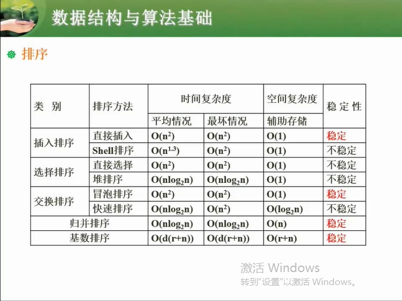
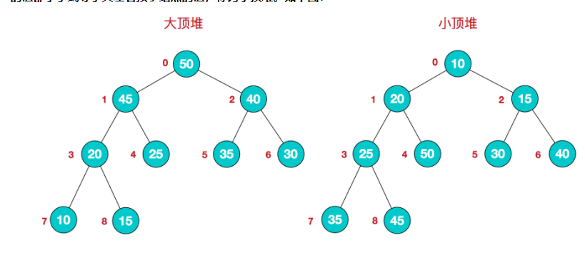
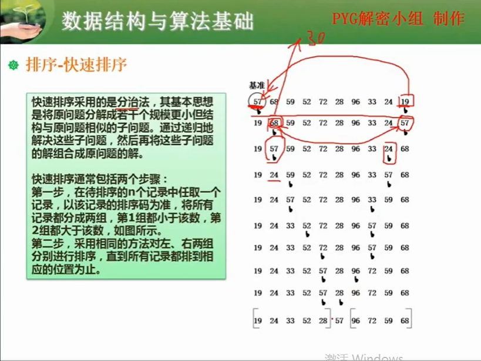
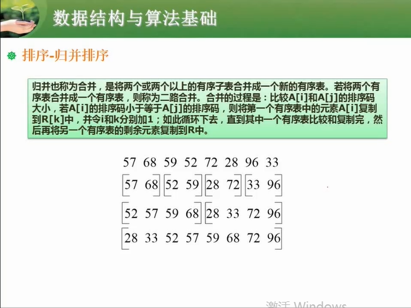

[TOC]


#### 1：算法的复杂度

$O(1) < O(\log_2n) < O(n) < O(n\log_2n) < O(n^2) < O(n^3) < O(2^n)$


#### 2：查找

+ 二分查找 ：$mid = [(low + high) / 2]_{floor}$
+ 散列表：hash函数


#### 3：排序

排序方式：

+ 插入类：直接插入、希尔排序
+ 交换类：冒泡排序、快速排序
+ 选择类：简单选择、堆排序
+ 归并排序
+ 基数排序



占用空间：

+ 内排序：只使用内存
+ 外排序：使用外部存储


稳定与否

+ 稳定排序：不影响相同值原有的顺序
+ 不稳定排序：会影响相同值原有的顺序


#### 插入排序

例：插入排序的升序排序

**89** 45 54 29 90 34 68

**45 89** 54 29 90 34 68

**45 54 89** 29 90 34 68

**29 45 54 89** 90 34 68

**29 45 54 89 90** 34 68

**29 34 45 54 89 90** 68

**29 34 45 54 68 89 90**

```java
     public static void basal(int[] array) {
          if (array == null || array.length < 2) {
             return;
         }
          // 从第二项开始
          for (int i = 1; i < array.length; i++) {
              int cur = array[i];
              // cur 落地标识，防止待插入的数最小
              boolean flag = false;
             // 倒序遍历，不断移位
             for (int j = i - 1; j > -1; j--) {
                 if (cur < array[j]) {
                     array[j + 1] = array[j];
                 } else {
                     array[j + 1] = cur;
                     flag = true;
                     break;
                 }
             }
             if (!flag) {
                 array[0] = cur;
             }
         }
    }

```


#### 希尔排序

直接插入排序的变种

- 记录按下标的一定增量分组，对每组进行直接插入排序。
- 不断地缩小增量，对每组进行直接插入排序，直至增量为1。

```java
     public static void basal(int[] array) {
          if (array == null || array.length < 2) {
              return;
          }
          // 初始增量
          int d = array.length >>> 1;
          while (d > 0) {
              // d 次直接插入排序
              for (int i = 0; i < d; i++) {
                 // 组内进行，相隔增量 d 项的直接插入排序
                 for (int j = i + d; j < array.length; j += d) {
                     int cur = array[j];
                     boolean flag = false;
                     for (int k = j - d; k > -1; k -= d) {
                         if (cur < array[k]) {
                             array[k + d] = array[k];
                         } else {
                             array[k + d] = cur;
                             flag = true;
                             break;
                         }
                     }
                     if (!flag) {
                         array[i] = cur;
                     }
                 }
             }
             // 每次增量减半
             d >>>= 1;
         }
     }
```


#### 直接选择排序

找出最小的数放前面

```java
void selectSort(int a[],int n){
    for(int i=1;i<=n-1;i++){//进行n-1趟选择
        int index=i;
        for(int j=i+1;j<=n;j++)//从无序区选取最小的记录
            if(a[index]>a[j])
                index=j;
        if(index!=i)
            swap(a[i],a[index]);
    }
}

```


#### 堆排序

**堆是具有以下性质的完全二叉树：每个结点的值都大于或等于其左右孩子结点的值，称为大顶堆；或者每个结点的值都小于或等于其左右孩子结点的值，称为小顶堆。如下图：**



**大顶堆：arr[i] >= arr[2i+1] && arr[i] >= arr[2i+2]**  

**小顶堆：arr[i] <= arr[2i+1] && arr[i] <= arr[2i+2]**  


##### 排序的基本思路：

　　**a.将无需序列构建成一个堆，根据升序降序需求选择大顶堆或小顶堆;**

　　**b.将堆顶元素与末尾元素交换，将最大元素"沉"到数组末端;**

　　**c.重新调整结构，使其满足堆定义，然后继续交换堆顶元素与当前末尾元素，反复执行调整+交换步骤，直到整个序列有序。**

```java
package sortdemo;

import java.util.Arrays;

/**
 * Created by chengxiao on 2016/12/17.
 * 堆排序demo
 */
public class HeapSort {
    public static void main(String []args){
        int []arr = {9,8,7,6,5,4,3,2,1};
        sort(arr);
        System.out.println(Arrays.toString(arr));
    }
    public static void sort(int []arr){
        //1.构建大顶堆
        for(int i=arr.length/2-1;i>=0;i--){
            //从第一个非叶子结点从下至上，从右至左调整结构
            adjustHeap(arr,i,arr.length);
        }
        //2.调整堆结构+交换堆顶元素与末尾元素
        for(int j=arr.length-1;j>0;j--){
            swap(arr,0,j);//将堆顶元素与末尾元素进行交换
            adjustHeap(arr,0,j);//重新对堆进行调整
        }

    }

    /**
     * 调整大顶堆（仅是调整过程，建立在大顶堆已构建的基础上）
     * @param arr
     * @param i
     * @param length
     */
    public static void adjustHeap(int []arr,int i,int length){
        int temp = arr[i];//先取出当前元素i
        for(int k=i*2+1;k<length;k=k*2+1){//从i结点的左子结点开始，也就是2i+1处开始
            if(k+1<length && arr[k]<arr[k+1]){//如果左子结点小于右子结点，k指向右子结点
                k++;
            }
            if(arr[k] >temp){//如果子节点大于父节点，将子节点值赋给父节点（不用进行交换）
                arr[i] = arr[k];
                i = k;
            }else{
                break;
            }
        }
        arr[i] = temp;//将temp值放到最终的位置
    }

    /**
     * 交换元素
     * @param arr
     * @param a
     * @param b
     */
    public static void swap(int []arr,int a ,int b){
        int temp=arr[a];
        arr[a] = arr[b];
        arr[b] = temp;
    }
}
```

#### 冒泡排序

```java
 private static void bubbleSort(int[] arr) {
        if(arr==null || arr.length < 2 ){
            return;
        }
        for (int i = 0; i < arr.length - 1; i++) {
            for (int j = 0; j < arr.length - i -1; j++) {   // 这里说明为什么需要-1
                if (arr[j] > arr[j + 1]) {
                    int temp = arr[j];
                    arr[j] = arr[j + 1];
                    arr[j + 1] = temp;
                }
            }
        }
    }
```

#### 快速排序



```java
 public static void main(String[] args) {

        int[] arr = {4,2,35,9,7,8,1,5,0,4,3};
        quickSort(arr, 0, arr.length - 1);
        ArrayUtil.print(arr);
    }

    private static  void quickSort(int[] arr, int left, int right){

        if (left >= right) {    // 必须加
            return;
        }

        int temp = arr[left]; // 以左边的元素为基准元素
        int i = left, j = right; // i,j为两个游标
        while (i < j) {
            while (i < j && arr[j] >= temp){ // 右边先走
                j--;
            }
            while (i < j && arr[i] <= temp) {
                i++;
            }
            if (i < j) {
                swap(arr, i, j);
            }
        }
        arr[left] = arr[i]; // 注意，这一步必须要，填上最左边的坑
        arr[i] = temp; // 基准元素就位
        quickSort(arr, left, i - 1);    // 递归操作左边部分
        quickSort(arr, i + 1, right);   // 递归操作右边部分
    }

    /**
     * 交换两个元素
     * @param arr
     * @param i
     * @param j
     */
    private static void swap(int[] arr, int i, int j) {
        int temp = arr[i];
        arr[i] = arr[j];
        arr[j] = temp;
    }
```

#### 归并排序




```java
    public static void main(String[] args) {
        int[] arr = {1, 2, 4, -1, 3, 4, 6, 8, 0, -2, 5};
        System.out.println(Arrays.toString(mergeSort(arr)));
    }

    /**
     * 采用递归处理
     * (分解)
     */
    private static int[] mergeSort(int[] sourceArr) {
        if (sourceArr.length < 2) { // 这里处理递归结束条件，当被拆解到只有一个元素时，一个元素必定有序
            return sourceArr;
        }
        int mid = sourceArr.length / 2;
        // 将sourceArr拆分成左右两部分
        int[] left = Arrays.copyOfRange(sourceArr, 0, mid); // 不包含mid处的元素
        int[] right = Arrays.copyOfRange(sourceArr, mid, sourceArr.length);
        // 合并"排序后"的左右部分
        return merge(mergeSort(left), mergeSort(right));
    }

    /**
     * 归并两个"有序"的数组
     * @return 合并后的新的数组
     */
    private static int[] merge(int[] arr1, int[] arr2) {
        // 1 处理边界情况
        if (arr1 == null || arr1.length == 0) {
            return arr2 == null || arr2.length == 0 ? null : arr2;
        }
        if (arr2 == null || arr2.length == 0) {
            return arr1;
        }

        int[] resArr = new int[arr1.length + arr2.length];
        int resIndex = 0; // resArr的下标
        int arr1Index = 0;
        int arr2Index = 0;
        // 2 做合并
        while (arr1Index < arr1.length && arr2Index < arr2.length) {
            resArr[resIndex++] = arr1[arr1Index] <= arr2[arr2Index] ?
                    arr1[arr1Index++] : arr2[arr2Index++]; // 三个下标做自加
        }
        // 3 处理剩余的数组（这里需要清楚，arr1Index或者arr2Index是对应数组中还没有处理的元素下标）
        if (arr1Index < arr1.length) {
            System.arraycopy(arr1, arr1Index, resArr, resIndex, arr1.length - arr1Index);
        }
        if (arr2Index < arr2.length) {
            System.arraycopy(arr2, arr2Index, resArr, resIndex, arr2.length - arr2Index);
        }
        return resArr;
    }
```

#### 基数排序

> 基数排序是一种借助多关键字排序思想对单逻辑关键字进行排序的方法。基数排序个是星于关键字比较的排序方法，它适合于元素很多而关键字较少的序列。基数的选择和关键字的分解是根据关键字的类型来决定的,例如关键字是十进制数,则按个位、十位来分解。

