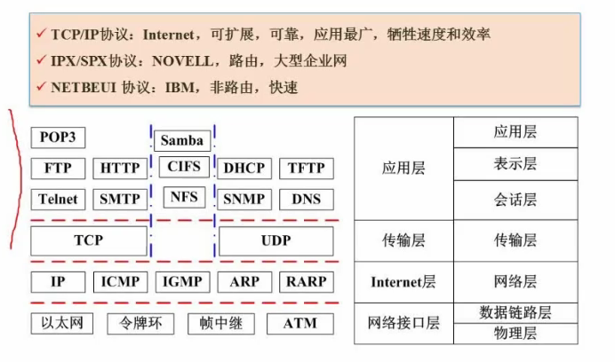
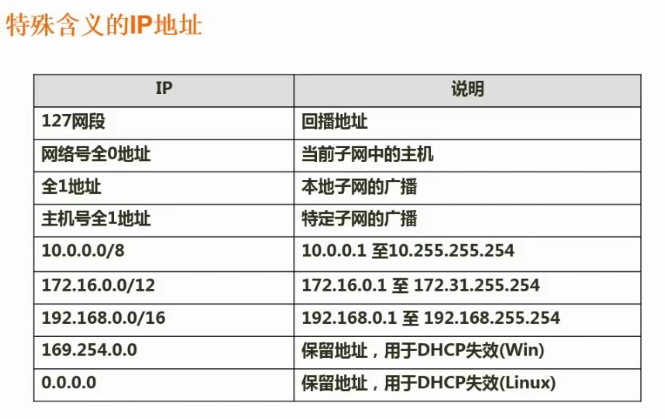

### 一：网络基础

#### 1：计算机网络分类

+ 分布范围
  + 局域网（LAN）
  + 城域网（MAN）
  + 广域网（WAN）
  + 因特网
+ 拓扑结构
  + 总线型
  + 星型
  + 环型

#### 2：OSI/RM七层模型

<table>
	<tr >
		<td rowspan="3">应用层</td>
		<td>7</td>
	    <td>应用层</td>
	    <td>实现具体的应用功能</td>
		<td rowspan="3">POP3、FTP、HTTP、Telnet、SMTP、DHCP、TFTP、SNMP、DNS</td>	    
	</tr>
	<tr >
		<td>6</td>
	    <td>表示层</td>
	    <td>数据的格式与表达、加密、压缩</td>
		<td></td>	    
	</tr>
	<tr >
		<td>5</td>
	    <td>会话层</td>
	    <td>建立、管理和终止会话</td>
		<td></td>	    
	</tr>    
	<tr >
		<td>传输</td>
		<td>4</td>
	    <td>传输层</td>
	    <td>端到端的连接</td>
		<td>TCP、UDP</td>	    
	</tr>    	
	<tr >
		<td>网络</td>
		<td>3</td>
	    <td>网络层</td>
	    <td>分组传输和路由选择</td>
		<td>三层交换机、路由器、ARP、RARP、IP、ICMP、IGMP</td>	    
	</tr>    	
	<tr >
		<td rowspan="2">物理层</td>
		<td>2</td>
	    <td>数据链路层</td>
	    <td>传输以帧为单位的信息</td>
		<td>网桥、交换机、网卡、PPTP、L2TP、SLIP、PPP</td>	    
	</tr>    	    
	<tr >
		<td>1</td>
	    <td>物理层</td>
	    <td>二进制传输</td>
		<td>中继器、集线器</td>
	</tr>    		
</table>

### 二：网络协议

#### 3：网络技术标准与协议

+ TCP/IP协议：Internet，详细见上面的表格
+ IPX/SPX：Novell 大型企业网
+ NETBEUI：IBM 非路由 快速

##### 3.1、DNS协议

+ 递归查询：主机向本地域名服务器询问域名对应的ip，本地会把最终结果返回
+ 迭代查询：本地域名服务器向根域名服务器询问域名对应的ip，根域名服务器会转发

### 三：网络设备
详细见上面的表格

### 四：IP地址
#### 4：IP地址

| 类型      | ip地址范围                | 网络段开头二进制 | 网络段长度 | 主机段长度 |      |
| --------- | ------------------------- | ---------------- | ---------- | ---------- | ---- |
| A         | 0.0.0.0-127.255.255.255   | 0                | 8          | 24         |      |
| B         | 128.0.0.0-191.255.255.255 | 10               | 16         | 16         |      |
| C         | 192.0.0.0-223.255.255.255 | 110              | 24         | 8          |      |
| D（组播） | 224.0.0.0-239.255.255     | 1110             |            |            |      |
| E(保留)   | 240.0.0.0-255.255.255.255 | 1111             |            |            |      |

#### 5：子网掩码

#### 6：子网划分与路由汇聚

子网划分：

​	1.子网掩码

​	2.将一个网络划分成多个子网

​	3.将多个网络合并成一个大的网络

> 例1：将B类IP地址168.195.0.0划分为27个子网，子网掩码为多少
>
> 168.195.0.0->1010 1000 1100 0011 0000 0000 0000 0000
>
> 前16位为网络段
>
> 设要取k位来划分N个子网，16位后取1位，能够划分两个，2位能够划分4个，
>
> 即 2^k^=N。
>
> 因为2^5^=32>27，所起取前5位来划分子网
>
> 所以子网掩码为前16位1+5位1=1111 1111 1111 1111 1111 1000 0000 0000
>
> 即255.255.248.0

> 例2：将B类IP地址168.195.0.0划分为若干子网，每个子网内有主机700台，子网掩码为多少？
>
> 解题思路：根据700台需要多少个主机号逆推
>
> 2^k^-2>=700, k=10
>
> 所以子网掩码为：1111 1111 1111 1111 1111 1100 0000 0000
>
> 即255.255.252.0

无分类编址（无类域间路由）

IP地址 ::={<网络前缀>，<主机号>}

128.14.32.0/20 表示前20位为网络前缀有多少位，所以这个地址块总共有2^32-20^=2^12^个地址

由于全0和全1不用，其实总共可用为2^12^-2个

> 例：分配给某公司网络的地址块是210.115.192.0/20，该网络可以被划分为( )）个C类子网。
>
> A：4   B：8   C：16   D：32
>
> 解：网络前缀有 20位，还剩12个主机号
>
> C类子网前24个是网络号，后面8个是主机号，所以还能拿出4个位来做子网号，
>
> 所以答案为2^4^=16

### 7.特殊含义的IP地址

### 五：网络设计

#### 7：网络规划与设计

+ 规划原则
  + 实用
  + 开放
  + 先进性
+ 设计任务
  + 确定网络总体目标，设计原则
  + 通信子网设计
  + 资源子网设计
  + 设备选型
  + 网络操作系统和服务器资源设备
  + 网络安全设计
+ 设计原则
  + 可用性：可用时间占总时间百分比
  + 可靠性
  + 可恢复性：从故障中恢复
  + 适应性：适应用户用户要求
  + 可伸缩性
+ 实施原则
  + 可靠、安全、高效、可扩展
+ 实施步骤

#### 8：分层设计

+ 接入层：接入用户终端
+ 汇聚层：网络访问策略控制，数据包处理、过滤、寻址
+ 核心层：数据交换，转发

### 六：网络信息安全

#### 9 ：信息系统安全属性

| 属性       | 详细                                                   |
| ---------- | ------------------------------------------------------ |
| 保密性     | 最小授权原则、防暴露、信息加密、物理保密               |
| 完整性     | 安全协议、校验码、密码校验、数字签名、公证             |
| 可用性     | 综合保障（IP过滤、业务流控制、路由选择控制、审计跟踪） |
| 不可抵赖性 | 数字签名                                               |

### 七：加密解密技术

#### 10 ：加密算法

+ 对称加密（用于加密大量数据）

  DES、3DESC、AES、RC-5、IDEA

+ 非对称加密（用于加密对称加密算法的密钥）

  RSA

+ 信息摘要

  MD5、SHA、单向散列函数

  

#### 11：数字签名

+ 信息发送者A将数据D生成信息摘要（MD5、SHA）
+ 信息发送者A使用A的非对称加密的私钥加密信息摘要生产密文S（RSA）
+ 信息发送者A将密文发给接收者B
+ 信息接收者B使用A的非对称加密的公钥解密密文
+ 信息接收者B对接收到的数据D使用（MD5、SHA）生产信息摘要，同解密后的密文比对

#### 12：数字信封与PGP

+ 发送方使用对称密钥加密正文并传输
+ 发送方使用接收方的非对称密钥的公钥加密对称密钥并传输
+ 接收方使用自己的非对称密钥的私钥解密发送方的对称密钥
+ 接收方使用解密后的对称密钥解密数据

#### 13：设计邮件加密系统

+ 数字签名（信息摘要加密后的数据）使用发送方私钥
+ 加密大文件使用对称加密，密钥使用发送方的密钥
+ 发送方的对称密钥使用接收方的公钥加密

### 八：网络安全

#### 13：网络威胁与攻击

+ 重放攻击（ARP）
+ 拒绝服务（DOS）
+ 窃听
+ 业务流分析：长期监听，进行分析
+ 信息泄露
+ 破坏信息的完整性
+ 非授权访问
+ 假冒
+ 旁路控制：利用系统的缺陷

### 九：计算机病毒与木马